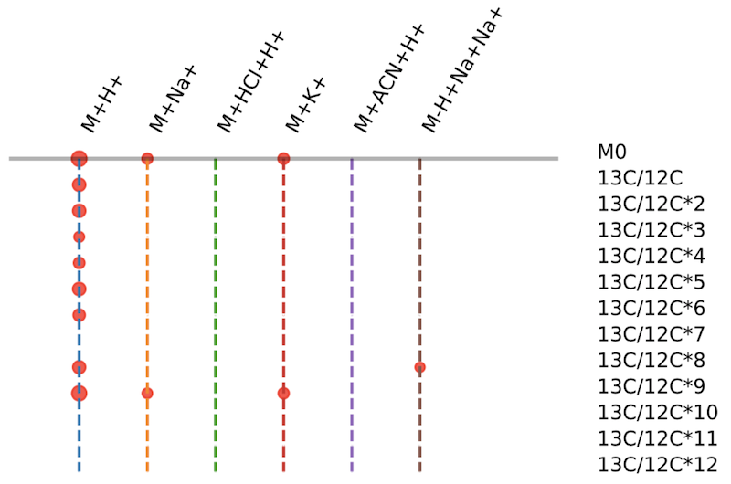

# khipu as a tree data structure to model a chemical compound in mass spectrometry data
This applies to regular LC-MS data, but also enables easy analysis of isotope tracing and chemical labeling data.

## Use

Best used as a library for software development or in a JupyterNotebook for data analysis. 
Example notebooks:
    notebooks/

Install as a package:
    pip install khipu-metabolomics

Run as a command line tool after installation:
    khipu -i testdata/ecoli_pos.tsv -o this_test

This will output pre-annotation to two files of JSON and tab delimited formats, this_test.json and this_test.tsv.

Run from source code:
    python3 -m khipu.main -i testdata/ecoli_pos.tsv -o this_test

Run test:
    python3 -m khipu.test
    (This downloads and uses test data from GitHub.)

## Why tree?
Grouping ions in mass spectrometry data to their origin compound is a key step of data annotation.
It's a common practice to search the data for signatures of mass differences, 
then combine overlap signatures as a network of ions (also called features or peaks).
Ideally, one wants to infer the neutral formula of the compound, 
and annotate how each ion is related to the origin compound. 
In such case, each ion should have only one unique "parent" in the mass difference network, 
and the network should have one origin compound as root. 
This becomes a tree structure.

In theory, multiple ions are measured in mass spectrometry for one origin compound,
because of two factors:
1) isotopes exists for atoms, which have difference mass values; and
2) modifications occur during the mass spectrometry analysis, including formation of adducts, ionization, in-source fragmentation and neutral loss.

Each ion is a result of combination of these two factors, and can be attributed to the origin compound.
Therefore, the ions can be adequately represented as a "leaf" on a tree, root being the origin compound.

Once we move beyond generic networks and use trees to annotate ions,
it is much easier to optimize algorithms and exchange annotations.

## What's "khipu"?
Khipu is a recording device using knots, often 2-level of strings,
historically used by people in Andean South America, includign Inca (https://en.wikipedia.org/wiki/Quipu).
The format is similar to how we represent isotopes and adducts in our data.
We chose "khipu" over the spelling of "quipu", to pay respect to the indigenous people.

## Tree and depth
After we get paired relationship between ions by mass differences, a tree may look like this:

    179.1123@172.9   #  (M0)
    └── 180.1156@172.9
        ├── 181.1198@171.7
        │   └── 182.1233@171.7    # (should be level 1 not lower)
        └── 181.1198@173.3        # problematic assignment

Here, each ion is denoted as m/z@retention_time. 
The above tree has a problem of tree depth.
For isotopes, M3 is not parent of M4 - they are children of root and at the same level.
For adducts, they should be at the same level because adduct formation is one-time event in ESI.
Thus, the annotation tree should have 2-levels: isotopes and adducts (and other modifications). 

The above tree has an additional problem, as we have two ions at 181.1198, 
one of which could be from a different origin compound.

## Algorithmic consideration: tree search vs network partitioning
Let's consider two senarios of constructing a khipu per origin compound:
a) search all isotopic trees and merge the adducts in an additional step, or 
b) search all isotopic pairs and all adduct pairs, form the network and partition the network.

The a) option may have problem if the merging only considers M0, 
which may not be the most abundant ion in isotope labeling experiments. 
I.e. M0 may not be measured for a compound and the adduct relation of M0s is broken.
If we have to search beyond M0 for adduct relations, a) offers no advantage.
Therefore, b) is the more generic solution.

## Implementation - overview
1. Get all pairs of features that match isotope patterns and adduct patterns. The patterns are provided as options and users can use their own patterns. The default match in LC-MS is based on m/z and retention time windows, while preprocessing software (asari) can require overlap scans.

2. Connect all pattern matched feature pairs to an overall network, which is further partitioned into connected subnetworks.

3. Each subnetwork becomes a khipu instance, after rule inspection and optimization to resolve ambiguity. A khipu is essentially an 'empirical compound' that is used for downstream annotation and analysis.

4. This library supports tree and grid visualization in plain text. Once imported to a Jupyter Notebook, one can use enhanced visualization schemes. The library can also be used by others for extended tools. 

## Assignment of ions to a khipu
The network formed by m/z pairs is redundant, especially when multiple isotopes exist. 
An example is that only half of edges are needed to connect the ions:

    >>> big[0].edges()
    [('F1478', 'F171'), ('F1478', 'F114'), ('F1478', 'F10'), ('F171', 'F114'), ('F171', 'F10'), ('F114', 'F10')]
    >>> T = nx.minimum_spanning_tree(big[0])
    >>> 
    >>> T.edges()
    [('F1478', 'F171'), ('F1478', 'F114'), ('F1478', 'F10')]
 
In theory, one can find the ion of lowest m/z, calculate all the combinations of isotopes and adducts, 
and match all ions to the calculated combinations (a grid). 
However, it will be problematic because each measurement has an error, 
and this method imposes the error of one ion to others, sufficient to cause wrong matches 
when m/z patterns are close. E.g. the m/z difference of 13C/12C is 1.003355 and that of a proton is 1.0073.
For high m/z values, their difference is sensitive to measurement errors. 

In this khipu library, we 
1. separate isotope edges and adduct edges.
2. treat all connected isotope edges as one branch.
3. establish a "trunk" of optimized list of adducts.
4. asssign each isotopic branch to the adduct trunk.
5. align isotopes in all branches to establish the khipu grid. 

Some ions may come into the initial network by mistakes or unresolved signals.
The are removed from the established khipu by clean-up rules, and sent off to form a new khipu.

## The khipu grid

Initial grid may look like this:

                   M+H[+]   M+NH4[+]   M+Na[+]   M+HCl+H[+]   M+K[+]   M+ACN+H[+]
    M0           1.007276  18.033826  22.989276  36.983976  38.963158  42.033825
    13C/12C      2.010631  19.037181  23.992631  37.987331  39.966513  43.037180
    13C/12C*2    3.013986  20.040536  24.995986  38.990686  40.969868  44.040535
    13C/12C*3    4.017341  21.043891  25.999341  39.994041  41.973223  45.043890
    13C/12C*4    5.020696  22.047246  27.002696  40.997396  42.976578  46.047245
    13C/12C*5    6.024051  23.050601  28.006051  42.000751  43.979933  47.050600
    13C/12C*6    7.027406  24.053956  29.009406  43.004106  44.983288  48.053955

This can be extended by searching for additional ions. But the core construction should be done first.

## Applicable to isotope tracing
The search pattern for isotopes is often dependent on the biochemical experiment.
Users can overwrite the default by supplying their search patterns (see demo notebooks).
Search patterns are separate from search functions, lending flexibiliy to data analysis.

The next step is to apply Khipu to chemical derivatization experiments.
In chemical derivatization experiments, the origin compound and derivatized compound can be both measured in the LC-MS data.
We have separate khipu trees for each, then link them by the m/z shift from derivatization.
Because derivatization is a reaction that occurs before LC-MS, and
LC-MS measures whatever compounds that are present in samples.

## Test data

Three datasets are included under testdata/. All three tables were generated by asari v1.9.2.
The automated khipu.test downloads ecoli_pos.tsv from GitHub remotely.
The ecoli_pos.tsv was generated by Li lab using the credentialed E. coli sample from Cambridge Isotopes.
The yeast datasets were from the NetID paper by Rabinowitz lab. 
The yeast_neg table is features that are filted by SNR > 100 to serve as a cleaner demo.

Input tables are tab delimited text files.
The first columns are feature ID, m/z, rtime, followed by intensities.
Users can specify the start column and end column of intensity data.

## Detailed use of command and parameters

    >>> khipu -h

    usage: main.py [-h] [-v] [-m MODE] [--ppm PPM] [--rtol RTOL] [-i INPUT]
                [-s START] [-e END] [-o OUTPUT]

    khipu, annotating metabolomics features to empCpds

    optional arguments:
    -h, --help            show this help message and exit
    -v, --version         print version and exit
    -m MODE, --mode MODE  mode of ionization, pos or neg
    --ppm PPM             mass precision in ppm (part per million), same as
                            mz_tolerance_ppm
    --rtol RTOL           tolerance of retention time match, arbitrary unit
                            dependent on preprocessing tool
    -i INPUT, --input INPUT
                            input file as feature table
    -s START, --start START
                            start column for intensity in input table
    -e END, --end END     end column for intensity in input table
    -o OUTPUT, --output OUTPUT
                            prefix of output files

## Khipus are used as empirical compounds 
- Empirical compound is defined at https://github.com/shuzhao-li/metDataModel
- Khipu defines the MS1 pseudo spectra for empirical compounds
- Empirical compounds are designed to include additional annotations, including from tandem mass spec data and database searches

